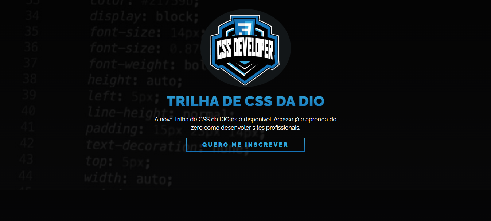

## 👨‍💻 Desafio de Projeto CSS: Criando sua primeira Landing Page com HTML e CSS
Projeto de HMTL e CSS proposto pela expert Michele Ambrosio da plataforma educacional DIO.

## 💻 Tecnologias usadas:

  
  

## Preview:

- Venha ver como ficou o projeto acessando [aqui nesse link do GithubPages](https://marcoswinther.github.io/project-css-dio-landing-page/)

## ⚙ Execução desse projeto:
1. **Clonar Repósitório:** basta utilizar o comando `git clone` para clonar esse projeto e salvar na máquina e depois executar o arquivo `index.html`.
2. **GitHubPages:** pode também acessar o projeto nesse [link](https://marcoswinther.github.io/project-css-dio-landing-page/), que abrirá esse projeto no GitHubPages, sem precisar baixar o repositório na sua máquina.

## 🤔 O que foi feito nesse projeto:
- Segui conforme o protótipo no Figma do Desafio de Projeto. Apliquei todo o conhecimento adquirido nos cursos da Formação CSS Developer na plataforma DIO.

## 📌 Créditos
- **Assets:** Disponível no protótipo do Figma disponibilizado no curso.
